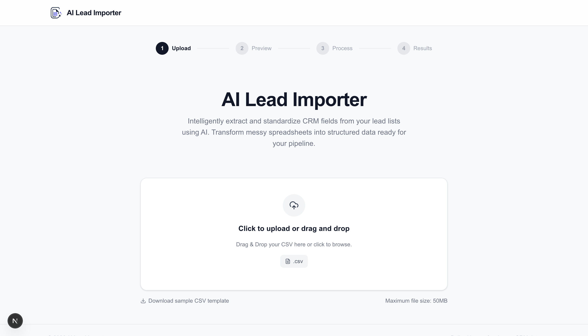
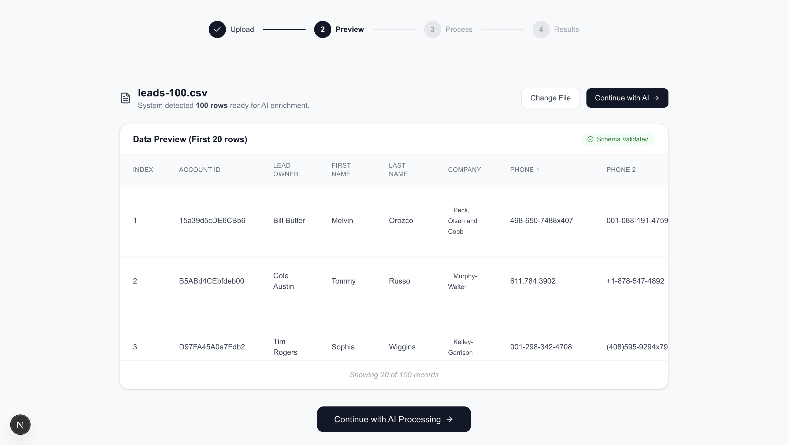
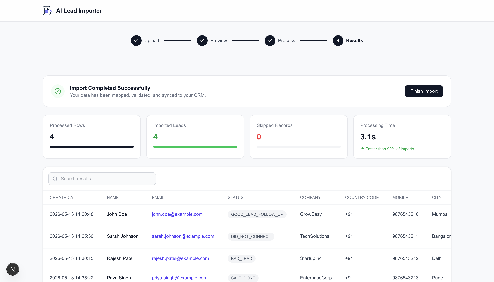

# AI Lead Importer

An AI-powered CRM Lead Importer that intelligently extracts and standardizes lead information from CSV files into a predefined CRM schema using **Google Gemini AI**.

Built as a full-stack application with **Next.js**, **Express.js**, **TypeScript**, and **Gemini AI**.

---

# Features

- Drag & Drop CSV Upload
- CSV Preview Before Import
- AI-Powered CRM Field Extraction
- Batch Processing for Large CSV Files
- Intelligent Schema Mapping
- Import Statistics Dashboard
- Searchable CRM Results Table
- Responsive Modern UI
- Fast TypeScript Backend
- Cloud Deployment Ready

---

##  Tech Stack

### Frontend

- Next.js
- React
- TypeScript
- Tailwind CSS
- Lucide Icons

### Backend

- Node.js
- Express.js
- TypeScript
- Multer
- PapaParse

### AI

- Google Gemini API

---

## Project Structure

```
AI_Lead_Importer/

├── frontend/
│   ├── app/
│   ├── components/
│   ├── services/
│   ├── lib/
│   └── types/
│
├── backend/
│   ├── src/
│   │   ├── routes/
│   │   ├── services/
│   │   ├── prompts/
│   │   └── server.ts
│   │
│   └── package.json
│
└── README.md
```

---

##  Workflow

```
Upload CSV
      │
      ▼
Preview Data
      │
      ▼
Batch Processing
      │
      ▼
Gemini AI Extraction
      │
      ▼
CRM Field Mapping
      │
      ▼
Import Statistics
      │
      ▼
Results Table
```

---

## AI Extraction

The application extracts and standardizes the following CRM fields:

- created_at
- name
- email
- country_code
- mobile_without_country_code
- company
- city
- state
- country
- lead_owner
- crm_status
- crm_note
- data_source
- possession_time
- description

The AI follows strict extraction rules for:

- Allowed CRM Status values
- Allowed Data Sources
- Date normalization
- Multiple email/mobile handling
- Invalid record skipping
- CRM note generation

---

##  Installation

### Clone

```bash
git clone https://github.com/<your-username>/AI_Lead_Importer.git
```

### Backend

```bash
cd backend

npm install
```

Create

```
.env
```

```env
GEMINI_API_KEY=YOUR_API_KEY
```

Run

```bash
npm run dev
```

---

### Frontend

```bash
cd frontend

npm install

npm run dev
```

---

##  Deployment

Frontend

- Vercel

Backend

- Render

---

##  Screenshots

### Upload Screen



### Preview Screen



### AI Processing


### Results Dashboard



---

##  Future Improvements

- Server Sent Events (Real-time progress)
- Error Log Downloads
- Duplicate Lead Detection
- CSV Export
- AI Confidence Score
- Parallel Batch Processing
- Streaming or Incremental Processing
- Retry mechanism for failed batches

---

##  Author

**Shreyaa Katiyar**

GitHub:
https://github.com/Shreyaakatiyar